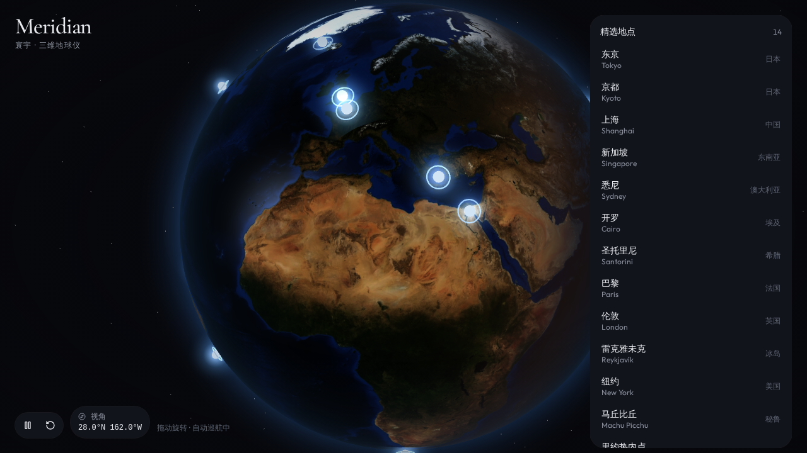
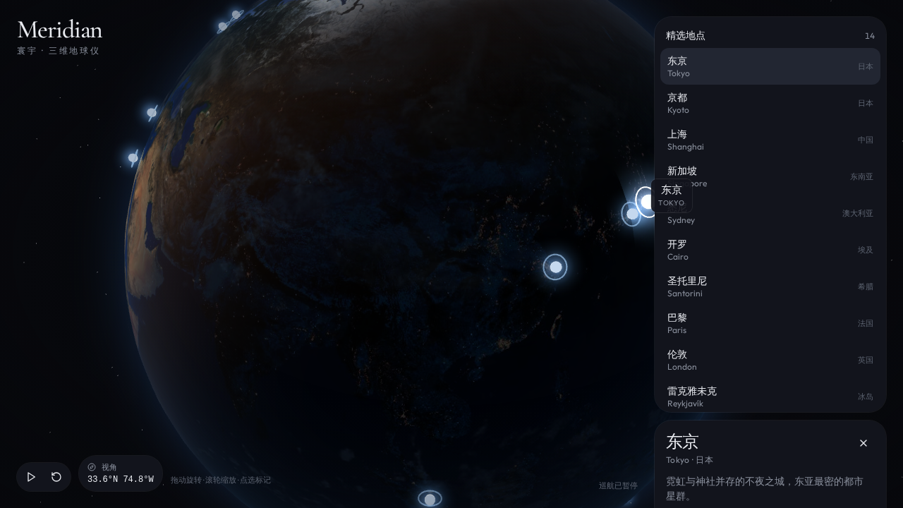
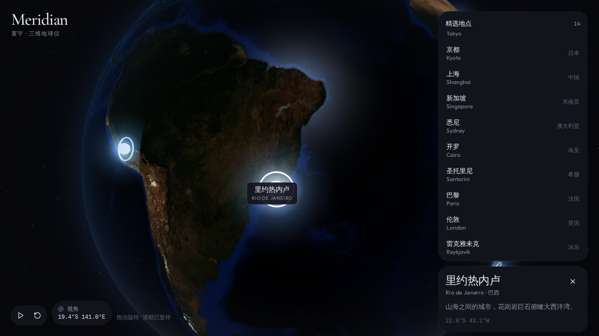

# Meridian · 寰宇

可旋转的三维地球仪。拖动探索，点选发光地点，镜头缓缓聚焦。

A full-viewport 3D globe with glowing city markers, drag-to-rotate, click-to-focus, and auto-rotation that pauses while you interact.

<p>
  
</p>

<p>
  
  
</p>

## Features

- **整屏地球** — 昼夜贴图、夜景灯火、薄大气层与星空
- **拖动 / 缩放** — 轨道控制器，带阻尼
- **发光标记** — 14 个精选地点，悬停显示名称，点击飞向该点
- **镜头过渡** — 球面插值，不会穿过地球
- **自动巡航** — 空闲时缓缓自转，交互或飞向时暂停
- **地点列表** — 桌面侧栏，手机底部抽屉
- **柔和环境光** — 半球光 + 方向光（太阳）+ 自定义着色器

## Stack

| Layer | Choice |
| --- | --- |
| UI | React 19, TanStack Start / Router, Tailwind CSS v4 |
| 3D | Three.js, React Three Fiber, drei |
| State | Zustand |
| Earth | Procedural `sphereGeometry` + custom GLSL (not a glTF mesh) |

地球几何由代码生成；`public/textures/` 里是等距圆柱投影贴图（白天、夜景、海洋遮罩、地形）。

## Getting started

需要 [Node.js 22](https://nodejs.org/) 或以上。

```bash
git clone https://github.com/Lanxchan/3D-globe.git
cd 3D-globe
npm install
npm run dev
```

浏览器打开终端提示的本地地址。其他常用命令：

```bash
npm run build       # 生产构建
npm run typecheck   # TypeScript
npm run lint
```

## Project structure

```
src/
  components/globe/     地球、大气、标记、镜头、画布
  components/globe-app.tsx
  lib/globe/            经纬度转换、地点数据、Zustand
  routes/               页面路由
public/textures/        地球贴图
```

| File | Role |
| --- | --- |
| [`src/components/globe/earth.tsx`](src/components/globe/earth.tsx) | 球体 + 昼夜/高光/大气着色器 |
| [`src/components/globe/markers.tsx`](src/components/globe/markers.tsx) | 发光标记与标签 |
| [`src/components/globe/camera-rig.tsx`](src/components/globe/camera-rig.tsx) | 飞向动画 |
| [`src/lib/globe/places.ts`](src/lib/globe/places.ts) | 14 个地点（中英名、经纬度、一句话） |
| [`src/lib/globe/geo.ts`](src/lib/globe/geo.ts) | `lat/lng ↔ Vector3` |

## Locations

东京 · 京都 · 上海 · 新加坡 · 悉尼 · 开罗 · 圣托里尼 · 巴黎 · 伦敦 · 雷克雅未克 · 纽约 · 马丘比丘 · 里约热内卢 · 开普敦

在 [`src/lib/globe/places.ts`](src/lib/globe/places.ts) 里增删即可，标记会跟着更新。

## License

[MIT](LICENSE)
